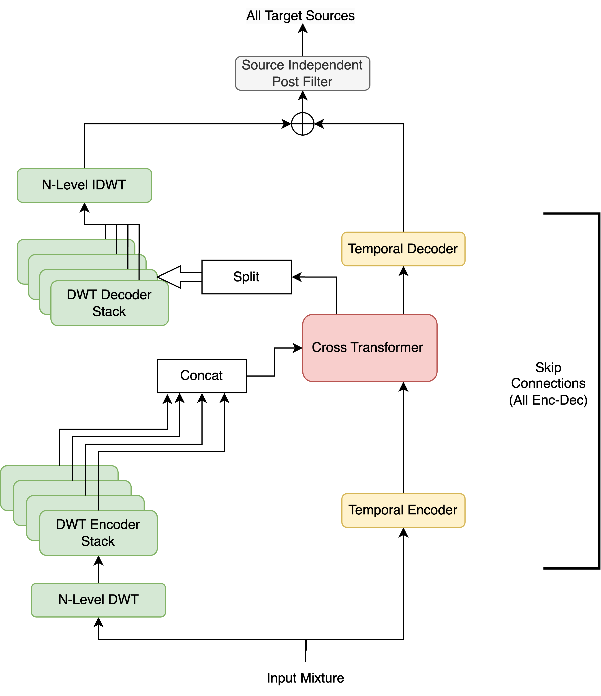

# DWT-Transformer-UNet
Nabarun Goswami

**Affiliation:** Harada-Osa-Mukuta-Kurose Lab, The University of Tokyo

This model is implemented in: [iSeparate/models/dwt_transformer_unet/dwt_transformer_unet.py](..%2F..%2FiSeparate%2Fmodels%2Fdwt_transformer_unet%2Fdwt_transformer_unet.py)
## Model architecture

## Model description

We use a simple multi-path UNet architecture, with a Cross Transformer in the middle. This model performs better than the Wavelet-HTDemucs model in local validation.

- The input mixture is passed through `N` levels of Discrete Wavelet Transform (DWT) to obtain the wavelet coefficients.
- The DWT coefficients at each level are processed independently by a stack of `N+1` encoders.
  - The encoders have different depth, depending on the level of wavelet coefficient they process.
- The outputs of the encoders are concatenated passed through a Cross Transformer, along with the output of the temporal encoder which processes the raw waveform. 
  - The Cross Transformer is similar to the one used in [HTDemucs](https://arxiv.org/abs/2211.08553).
- The outputs of the Cross Transformer are passed through a stack of `N+1` decoders and the temporal decoder independently.
- The outputs of DWT decoder stack are then converted back to original time domain using Inverse DWT (IDWT).
- The outputs of the temporal decoder are added to the outputs of the DWT decoder stack to obtain the initial estimates.
- The initial estimates are then passed through source-independent post-filters to obtain the final estimates.
- Skip connections are used to connect all corresponding encoders and decoders.