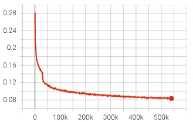
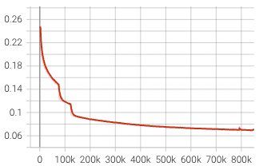
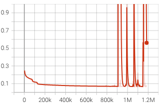

# Noise Robust Training for Leaderboard A and B

These functions are present in [iSeparate/losses/pairwise.py](..%2F..%2FiSeparate%2Flosses%2Fpairwise.py).

## Version 1
The first version of the noise robust training was used to train the Wavelet-HTDemucs model. 

The loss function was composed of the following components

1. L1 loss between outputs and targets
   1. Used at the beginning to guide the model to output fixed source assignments
   2. Turned off later in training
2. Mixture Invariant Loss 
   1. Randomly combine the noisy target sources into two mixtures with two noisy targets in each
3. Mean Teacher Loss
   1. Use the EMA model to separate each individual noisy target source and recombine corresponding source outputs to form the new targets
   2. Apply L1 loss between the outputs and the new targets

These loss components were weighted and applied with the following schedule and weights

| Epochs  | L1  | MixIt | Mean Teacher |
|:-------:|:---:|:-----:|:------------:|
|  ~100   |  1  |   1   |      0       |
| 101-200 |  1  |   2   |      1       |
|  201~   |  0  |   2   |      1       |

300 iterations per epoch with batch size of 32 of length 7 seconds each.

Following is the loss curve for the training with labelnoise data:

## Version 2
The second version of the noise robust training was used to train the DWT-Transformer-UNet model. 

The loss function was composed of the following components

1. L1 loss between outputs and noisy targets
   1. Used at the beginning to guide the model to output fixed source assignments
   2. Turned off later in training
2. L1 loss between the input mixture and output mixture
3. Mixture Invariant Loss 
   1. Randomly combine the noisy target sources into two mixtures with two noisy targets in each
4. Mean Teacher Loss
   1. Use the EMA model to separate the mixture and form the new targets
   2. Apply L1 loss between the outputs and the new targets

These loss components were weighted and applied with the following schedule and weights

| Epochs | L1  | Mixture Consistency | MixIt | Mean Teacher |
|:------:|:---:|:----------:|:-----:|:------------:|
|  ~30   |  1  |     0      |   2   |      0       |
| 31-50  | 0.5 |    0.5     |   2   |     0.5      |
|  51~   |  0  |     1      |   2   |      1       |

2500 iterations per epoch with batch size of 16 of length 7 seconds each.

Following is the loss curve for the training with labelnoise data:

**NOTE**: With V2 we tried training for longer, but observed instability in the training.
We will investigate this further in the future. 
It might be due to some bug in the training resumption code as well

