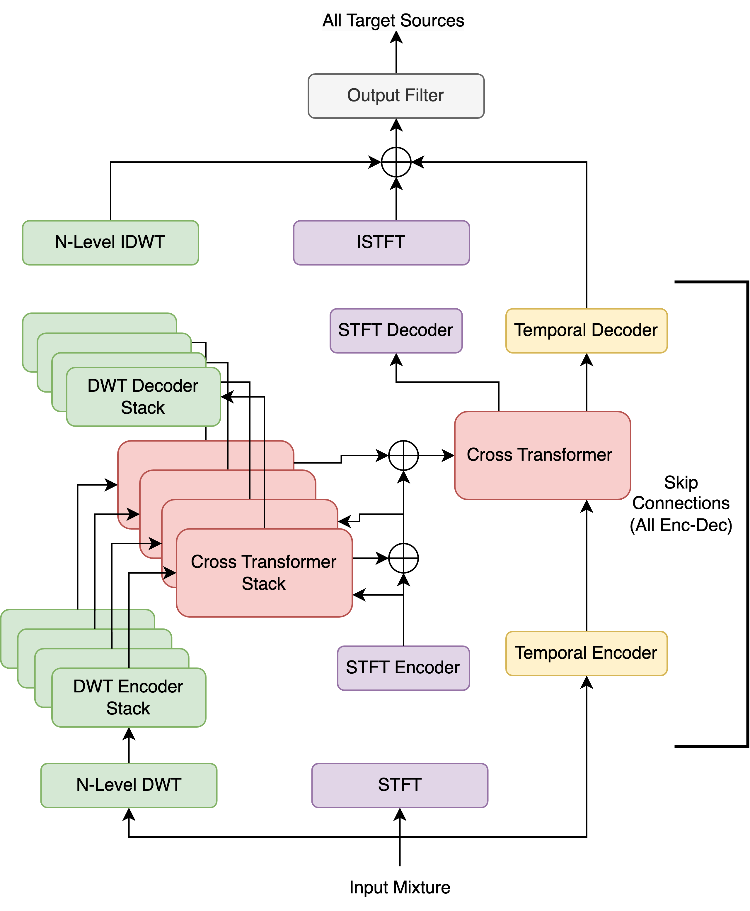

# Wavelet-HTDemucs
Nabarun Goswami

**Affiliation:** Harada-Osa-Mukuta-Kurose Lab, The University of Tokyo

This model is implemented in: [iSeparate/models/wavelet_htdemucs/wavelet_htdemucs.py](..%2F..%2FiSeparate%2Fmodels%2Fwavelet_htdemucs%2Fwavelet_htdemucs.py)
## Model architecture

[//]: # (![wavelet-htdemucs.png]&#40;imgs%2Fwavelet-htdemucs.png&#41;)

## Model description

We use multi-path UNet architecture, with a multiple Cross Transformers in the middle. 

This model has three main branches:
- DWT branch
  - Stack of enocders and decoders process each level of wavelet coefficients
- STFT branch
- Temporal branch

The three branches are combined as described below:
- Output of each encoder in the DWT branch is processed by an independent Cross Transformer along with the STFT encoder output.
- The frequency outputs of the Cross Transformer is added to the STFT encoder output as in residual connection.
- Above two steps are repeated for each level of wavelet coefficients.
- Finally the temporal encoder output and the processed STFT encoder output are passed through another Cross Transformer to get the frequency and temporal outputs
  - The Cross Transformer is similar to the one used in [HTDemucs](https://arxiv.org/abs/2211.08553).
- Skip connections are used to connect all corresponding encoders and decoders.

The outputs of the DWT decoder stack are then converted back to original time domain using Inverse DWT (IDWT).

The outputs of all three branches are added to obtain the initial estimates, 
which are filtered by a single layer of 1x1 convolution to obtain the final estimates.